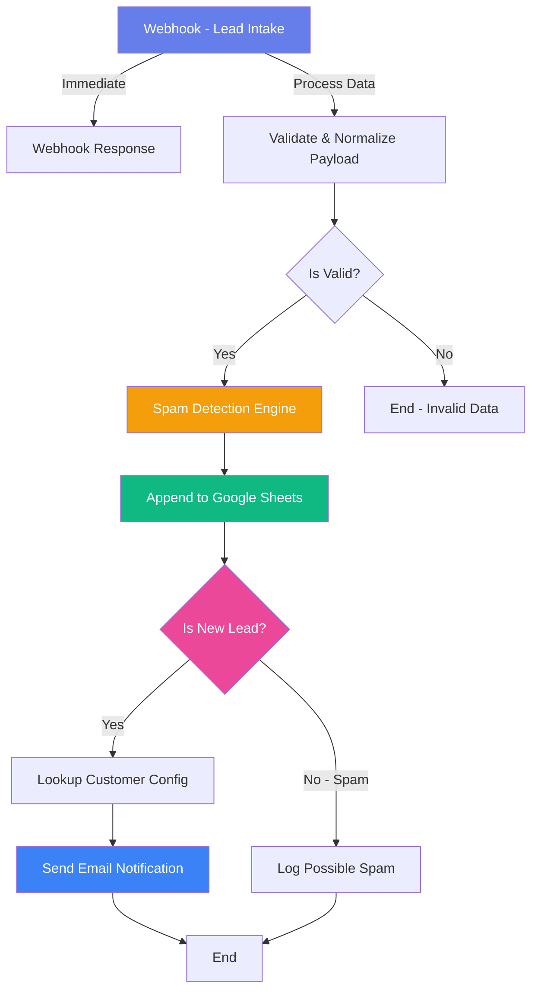
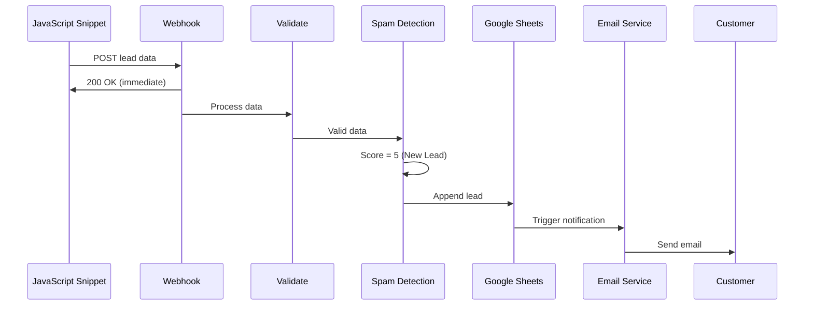
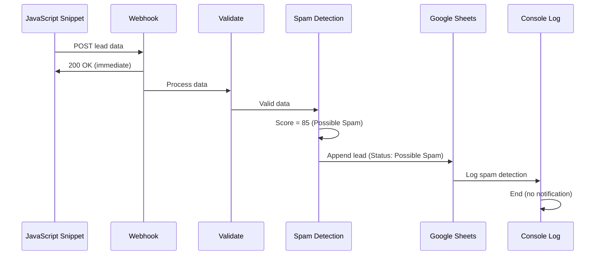

# N8N Workflow - Technical Explanation

## Overview

This document provides a comprehensive explanation of the N8N workflow architecture, node-by-node breakdown, and rationale for design decisions.

---

## Visual Workflow Diagram



---

## System Architecture

### Design Principles

1. **Non-blocking**: Webhook returns immediately (200 OK) while processing happens asynchronously
2. **Fail-safe**: Invalid data is logged but doesn't crash the workflow
3. **Observable**: Every step logs data for debugging
4. **Scalable**: Handles multiple customers via customer ID routing
5. **Idempotent**: Can be re-run without creating duplicates (though current version appends)

---

## Node-by-Node Breakdown

### 1. Webhook - Lead Intake

**Type**: Webhook Trigger (POST)
**Path**: `/webhook/leads`

**Purpose**: 
- Entry point for all lead submissions from the JavaScript snippet
- Activates the workflow when data is received

**Configuration**:
```json
{
  "httpMethod": "POST",
  "path": "leads",
  "responseMode": "responseNode"
}
```

**Why this design**:
- `POST` method for secure data transmission (not logged in server access logs like GET)
- Custom path `/leads` for clear intent and routing
- `responseNode` mode allows us to return a response immediately while processing continues

**Input** (from JavaScript snippet):
```json
{
  "name": "John Doe",
  "email": "john@example.com",
  "phone": "+1-555-0123",
  "message": "I'm interested in your services",
  "sourceUrl": "https://example.com/contact",
  "pageTitle": "Contact Us",
  "referrer": "https://google.com",
  "timestamp": "2026-02-02T07:49:08.123Z",
  "customerId": "acme-corp",
  "honeypotValue": "",
  "rawFields": {...}
}
```

---

### 2. Webhook Response

**Type**: Respond to Webhook
**Connected to**: Webhook - Lead Intake

**Purpose**:
- Immediately responds to the JavaScript snippet with HTTP 200 OK
- Prevents timeout issues if processing takes time
- Ensures user experience isn't degraded

**Response**:
```json
{
  "success": true,
  "message": "Lead received",
  "timestamp": "2026-02-02T07:49:08.000Z"
}
```

**Why this design**:
- Returns before heavy processing (spam detection, email sending)
- Gives the JavaScript snippet confirmation that data was received
- Includes timestamp for debugging

**Critical**: This runs in parallel with the rest of the workflow, so the user gets instant feedback.

---

### 3. Validate & Normalize Payload

**Type**: Function Node (JavaScript)
**Connected to**: Webhook - Lead Intake

**Purpose**:
1. Validate that minimum required data exists (email OR phone)
2. Normalize field names and values
3. Add defaults for missing fields
4. Structure data for downstream processing

**Logic**:
```javascript
// Minimum requirement: email OR phone must exist
if (!email && !phone) {
  return { valid: false, reason: 'Missing both email and phone' };
}

// Normalize all fields with defaults
const normalized = {
  name: (body.name || 'Unknown').trim(),
  email: email || 'N/A',
  phone: phone || 'N/A',
  message: (body.message || '').trim(),
  // ... enrichment data
  valid: true
};
```

**Why this design**:
- **Fail-safe**: Invalid data returns `valid: false` instead of crashing
- **Normalization**: Ensures consistent data structure for downstream nodes
- **Defaults**: Missing fields get sensible defaults (e.g., "Unknown" for name)
- **Trimming**: Removes whitespace to avoid "  " being treated as valid data

**Output**:
```json
{
  "valid": true,
  "name": "John Doe",
  "email": "john@example.com",
  "phone": "+1-555-0123",
  "message": "I'm interested",
  "submittedAt": "2026-02-02T07:49:08.123Z",
  "processedAt": "2026-02-02T07:49:09.001Z",
  ...
}
```

---

### 4. Is Valid?

**Type**: IF Node (Conditional)
**Connected to**: Validate & Normalize Payload

**Purpose**:
- Branch the workflow based on validation result
- Only process valid leads

**Condition**:
```javascript
{{ $json.valid }} equals "true"
```

**Why this design**:
- Prevents garbage data from reaching storage
- Makes debugging easier (invalid data doesn't pollute the database)
- Allows future addition of "invalid data handling" branch

**Branches**:
- **True** → Continue to Spam Detection
- **False** → End workflow (data is logged in N8N execution history)

---

### 5. Spam Detection Engine

**Type**: Function Node (JavaScript)
**Connected to**: Is Valid? (true branch)

**Purpose**:
- Analyze lead quality using multi-factor scoring
- Classify as "New Lead" or "Possible Spam"
- Provide explainable signals for manual review

**Algorithm**: See [spam-detection-logic.md](./spam-detection-logic.md) for full details.

**Signals evaluated**:
1. Disposable email domains (30 points)
2. Honeypot field filled (40 points)
3. Missing critical fields (20 points)
4. Suspicious email patterns (25 points)
5. Spam keywords (15 points)
6. Suspicious name patterns (10 points)

**Scoring**:
```javascript
const threshold = 50;
const classification = spamScore >= threshold ? 'Possible Spam' : 'New Lead';
```

**Why this design**:
- **Multi-factor**: Single signal (e.g., disposable email) won't trigger spam classification alone
- **Explainable**: Every score has associated signals for debugging
- **Tunable**: Threshold and signal weights can be adjusted based on real data
- **Conservative**: Threshold = 50 minimizes false positives (missing real leads is worse than getting spam)

**Output**:
```json
{
  ...all previous fields,
  "spamScore": 15,
  "spamSignals": ["Spam keywords detected: free money"],
  "status": "New Lead",
  "confidence": "Low"
}
```

---

### 6. Append to Google Sheets

**Type**: Google Sheets Node (Append)
**Connected to**: Spam Detection Engine

**Purpose**:
- Store ALL leads (both New Lead and Possible Spam) in Google Sheets
- Provide centralized data for reporting and manual review
- Create audit trail

**Configuration**:
```json
{
  "operation": "append",
  "sheetId": "{{ $env.GOOGLE_SHEET_ID }}",
  "range": "Leads!A:N",
  "valueInputMode": "USER_ENTERED"
}
```

**Column Mapping**:
| Sheet Column | JSON Field | Description |
|--------------|------------|-------------|
| Name | name | Contact name |
| Phone Number | phone | Contact phone |
| Email Address | email | Contact email |
| Lead Details | message | Lead message/inquiry |
| Status | status | "New Lead" or "Possible Spam" |
| Submission URL | sourceUrl | Page where form was submitted |
| Lead Source | referrer | Traffic source (referrer) |
| Customer Name | customerId | Customer identifier |
| Created At | submittedAt | Timestamp from user's browser |
| Updated At | processedAt | Timestamp from N8N processing |
| Spam Score | spamScore | Numeric spam score (0-100+) |
| Page Title | pageTitle | Page title where form was submitted |
| Form ID | formId | Form identifier |
| User Agent | userAgent | Browser user agent |

**Why this design**:
- **Central storage**: Single source of truth for all leads
- **Manual review**: Operators can manually reclassify spam
- **Reporting**: Easy to create pivot tables, charts, etc.
- **Audit trail**: Spam score and signals are preserved for analysis

**Important**: Current implementation uses `append` (always adds new row). For production, consider implementing upsert logic based on email+customerId to prevent duplicates if workflow is re-run.

---

### 7. Is New Lead?

**Type**: IF Node (Conditional)
**Connected to**: Append to Google Sheets

**Purpose**:
- Branch workflow based on spam classification
- Only send notifications for legitimate leads

**Condition**:
```javascript
{{ $json.status }} equals "New Lead"
```

**Why this design**:
- Prevents spam from triggering customer notifications
- Operators can manually review "Possible Spam" leads in Google Sheets
- If spam is reclassified to "New Lead", a separate trigger can send notification (future enhancement)

**Branches**:
- **True (New Lead)** → Lookup Customer Config → Send Email
- **False (Possible Spam)** → Log Possible Spam → End

---

### 8. Lookup Customer Config

**Type**: Code Node (JavaScript)
**Connected to**: Is New Lead? (true branch)

**Purpose**:
- Map customer ID to notification email address
- Support multi-customer deployment with different contact emails

**Configuration**:
```javascript
const customerConfig = {
  'acme-corp': { email: 'sales@acme-corp.com', name: 'ACME Corporation' },
  'beta-inc': { email: 'leads@beta-inc.com', name: 'Beta Inc' },
  'gamma-llc': { email: 'contact@gamma-llc.com', name: 'Gamma LLC' }
};
```

**Why this design**:
- **Per-customer routing**: Each customer gets their own notifications
- **Centralized config**: Easy to add new customers without changing workflow structure
- **Fallback**: Unknown customers get sent to default admin email

**Production enhancement**: Move this configuration to:
- Environment variables (`CUSTOMER_ACME_EMAIL=sales@acme-corp.com`)
- External database (Airtable, PostgreSQL)
- N8N credential store

**Output**:
```json
{
  ...all previous fields,
  "customerEmail": "sales@acme-corp.com",
  "customerName": "ACME Corporation"
}
```

---

### 9. Send Email Notification - New Lead

**Type**: Send Email Node (SMTP)
**Connected to**: Lookup Customer Config

**Purpose**:
- Notify customer contact person of new lead
- Provide all relevant lead details in formatted email
- Include link to Google Sheet for full context

**Email Template**:
- **Subject**: `🎯 New Lead: {name} from {customerId}`
- **Body**: HTML email with lead details, source context, and timestamp
- **CTA**: "View in Google Sheets" button

**Why this design**:
- **Rich HTML**: Professional formatting improves readability
- **Contextual data**: Includes source URL, referrer, page title for lead attribution
- **Actionable**: Direct link to Google Sheet for immediate follow-up
- **Spam indicator**: Shows spam score in footer for transparency

**Configuration**:
```json
{
  "fromEmail": "{{ $env.NOTIFICATION_FROM_EMAIL || 'leads@yourcompany.com' }}",
  "toEmail": "{{ $json.customerEmail }}",
  "subject": "🎯 New Lead: {{ $json.name }} from {{ $json.customerId }}",
  "emailType": "html"
}
```

**Email preview**:


---

### 10. Log Possible Spam

**Type**: Code Node (JavaScript)
**Connected to**: Is New Lead? (false branch)

**Purpose**:
- Log spam detections to N8N console for monitoring
- Helps identify spam patterns and tune detection logic
- No customer notification sent

**Logging output**:
```
========================================
POSSIBLE SPAM DETECTED
========================================
Email: spammer@tempmail.com
Spam Score: 75
Signals: Disposable email domain detected, Honeypot field was filled
Customer: acme-corp
========================================
```

**Why this design**:
- **Observable**: Operators can review N8N execution logs to see spam activity
- **Tuning**: Helps identify if threshold is too aggressive/lenient
- **Security**: Spam patterns can indicate attack attempts

**Production enhancement**: Send spam logs to:
- Dedicated Slack channel (#spam-alerts)
- Separate Google Sheet tab for spam analysis
- External monitoring service (Datadog, Sentry)

---

## Data Flow Example

### Scenario: Legitimate Lead Submission



**Timeline**:
- T+0ms: JavaScript sends data
- T+50ms: Webhook returns 200 OK
- T+100ms: Validation completes
- T+150ms: Spam detection completes (score: 5)
- T+300ms: Google Sheets append completes
- T+500ms: Email sent to customer

**Total latency**: ~500ms from submission to notification

---

### Scenario: Spam Submission



**Timeline**:
- T+0ms: JavaScript sends data
- T+50ms: Webhook returns 200 OK
- T+100ms: Validation completes
- T+150ms: Spam detection completes (score: 85)
- T+300ms: Google Sheets append completes
- T+350ms: Spam logged, workflow ends

**Result**: Lead stored in Google Sheets but NO email sent to customer.

---

## Multi-Customer Scaling

### How It Works

Each customer embeds the script with a unique `data-customer-id`:

**Customer A** (`acme-corp`):
```html
<script data-customer-id="acme-corp" ...></script>
```

**Customer B** (`beta-inc`):
```html
<script data-customer-id="beta-inc" ...></script>
```

### Routing Logic

1. **JavaScript** → Sends `customerId: "acme-corp"` in payload
2. **Webhook** → Single endpoint receives all leads
3. **Google Sheets** → All leads stored in one sheet with `Customer Name` column
4. **Lookup Customer Config** → Maps `acme-corp` → `sales@acme-corp.com`
5. **Email Notification** → Sent to correct customer contact

### Scalability

**Current design**: Single workflow handles all customers

**Limitations**:
- Google Sheets has a limit of ~5M cells
- Email sending rate limited by SMTP provider

**When to scale**:
- **10+ customers**: Consider per-customer Google Sheets (route based on customer ID)
- **1000+ leads/day**: Move to database (PostgreSQL, Airtable) instead of Google Sheets
- **100,000+ leads/day**: Use message queue (RabbitMQ, Redis) between webhook and processing

### Alternative Architectures

#### Option 1: Per-Customer Workflows
Each customer gets their own N8N workflow with dedicated webhook endpoint.

**Pros**: Complete data isolation, easier debugging
**Cons**: Harder to maintain (changes require updating multiple workflows)

#### Option 2: Database-Backed
Use PostgreSQL/MySQL instead of Google Sheets.

**Pros**: Better scalability, faster queries, built-in indexing
**Cons**: More complex setup, requires database management

#### Option 3: Hybrid (Recommended for Scale)
- Webhook → Message Queue (Redis)
- Worker processes consume queue and process leads
- Store in database with per-customer tables
- Google Sheets as a read-only reporting view

---

## Error Handling

### Webhook Failure
**Scenario**: N8N server is down

**Handling**:
1. JavaScript snippet retries 3 times with exponential backoff
2. After 3 failures, data is lost (no client-side persistence)

**Improvement**: Add local storage fallback in JavaScript to queue failed submissions.

---

### Google Sheets API Error
**Scenario**: Google Sheets API rate limit or authentication failure

**Current behavior**: Workflow fails, lead is lost

**Improvement**: Add error-catching node to:
- Retry Google Sheets append (3 attempts)
- If still fails, store in N8N database as backup
- Send alert to operations team

---

### Email Send Failure
**Scenario**: SMTP server is down or email address is invalid

**Current behavior**: Workflow fails at email node

**Improvement**: Add error-catching node to:
- Log failure to Google Sheet (`Email Failed` column)
- Retry email send later (using N8N schedule trigger)
- Send to backup email address (admin)

---

## Performance Considerations

### Bottlenecks

1. **Google Sheets API**: ~1-2 requests/second limit
2. **Email sending**: SMTP rate limits (varies by provider)
3. **JavaScript execution**: Function nodes have ~10s timeout

### Optimization Strategies

1. **Batch Google Sheets writes**: If receiving >100 leads/hour, batch writes every 5 minutes
2. **Async email sending**: Use queue-based email service (SendGrid, Mailgun) instead of SMTP
3. **Cache customer config**: Store in workflow static data instead of JavaScript object

---

## Monitoring & Observability

### Key Metrics to Track

1. **Lead volume**: Total leads per day/week/month
2. **Spam rate**: % of leads classified as spam
3. **Spam score distribution**: Histogram of scores (helps tune threshold)
4. **Processing latency**: Time from webhook to email sent
5. **Error rate**: % of workflows that fail

### Recommended Dashboards

**Google Sheets Pivot Table**:
- Rows: Customer Name, Status
- Values: Count of leads
- Filter: Date range

**N8N Execution History**:
- Filter by workflow ID
- Sort by status (error, success)
- Review error details for failed executions

---

## Future Enhancements

### 1. Status Monitor (Manual Reclassification)

**Goal**: If an operator changes a lead from "Possible Spam" to "New Lead" in Google Sheets, automatically send the notification.

**Implementation**:
1. Add Google Sheets Trigger node (watches for row updates)
2. Filter for status changes: `Possible Spam` → `New Lead`
3. Connect to "Send Email Notification" node

**Benefit**: Allows human review of borderline spam without losing leads.

---

### 2. Lead Enrichment

**Goal**: Automatically enrich leads with additional data.

**Data sources**:
- Clearbit: Company info from email domain
- NeverBounce: Email validation (deliverable vs. bounced)
- IP geolocation: Country, city from submission IP

**Implementation**:
- Add HTTP Request node after validation
- Call enrichment APIs
- Store enriched data in Google Sheets

**Benefit**: Better lead qualification and routing.

---

### 3. CRM Sync

**Goal**: Automatically create leads in CRM (HubSpot, Salesforce, Pipedrive).

**Implementation**:
- Add CRM node after "Is New Lead?" (true branch)
- Map lead fields to CRM fields
- Handle duplicates (upsert by email)

**Benefit**: Eliminates manual data entry, faster lead response time.

---

### 4. Advanced Analytics

**Goal**: Real-time dashboard of lead metrics.

**Tools**:
- Google Data Studio (connects to Google Sheets)
- Custom web dashboard (pulls from N8N API)
- Grafana + PostgreSQL

**Metrics**:
- Lead volume over time
- Conversion funnel (lead → qualified → customer)
- Spam detection accuracy
- Customer-specific metrics

---

## Security Considerations

### 1. Webhook Authentication

**Current**: Webhook is open (anyone with URL can POST)

**Recommendation**: Add authentication header

```javascript
// JavaScript snippet
headers: {
  'Authorization': 'Bearer YOUR_SECRET_TOKEN'
}
```

**N8N Webhook Settings**: Enable "Header Auth" and verify token.

---

### 2. Rate Limiting

**Goal**: Prevent abuse (spam bot flooding webhook)

**Implementation**:
- Add N8N rate limit node (limit requests per IP)
- Use Cloudflare in front of webhook for DDoS protection
- Implement CAPTCHA for high-volume forms

---

### 3. Data Privacy (GDPR)

**Requirements**:
- Consent tracking
- Data deletion requests
- Data export requests

**Implementation**:
1. Add `consentGiven` field to lead data
2. Add "Delete Lead" workflow triggered by support requests
3. Add "Export Lead Data" workflow for data subject access requests

---

## Troubleshooting Guide

See [operational-guide.md](./operational-guide.md) for detailed troubleshooting steps.

---

## Summary

This N8N workflow is designed for **production use** with:

✅ **Non-blocking architecture**: Fast webhook response
✅ **Robust spam detection**: Multi-factor scoring with explainable signals
✅ **Multi-customer support**: Single workflow handles all customers
✅ **Observable**: All data logged for debugging and tuning
✅ **Fail-safe**: Validation prevents garbage data from propagating
✅ **Scalable**: Can handle 100s of customers and 1000s of leads/day

**Next Steps**: Import workflow, configure Google Sheets and SMTP credentials, test with sample data, monitor for 100 leads, tune spam threshold based on actual false positive rate.
